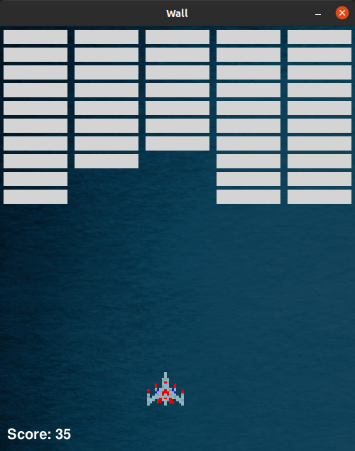
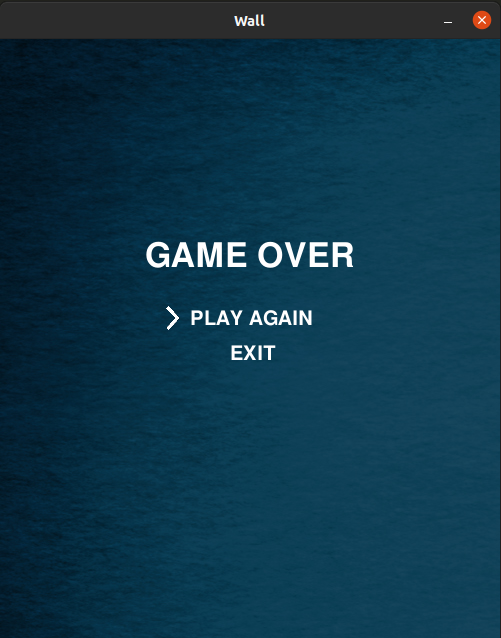

# Wall
The 2D game about shooting the wall which constantly moving toward your ship.

# Tools:
Python (3.8.5), module Pygame (1.9.6)

# How it looks like:

# License
The code is available under the [MIT](https://github.com/MartinTam/Wall/blob/main/LICENSE) license.
